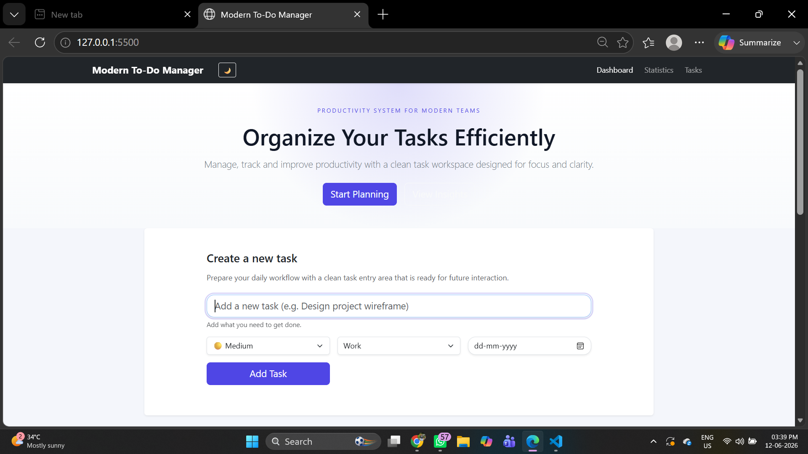
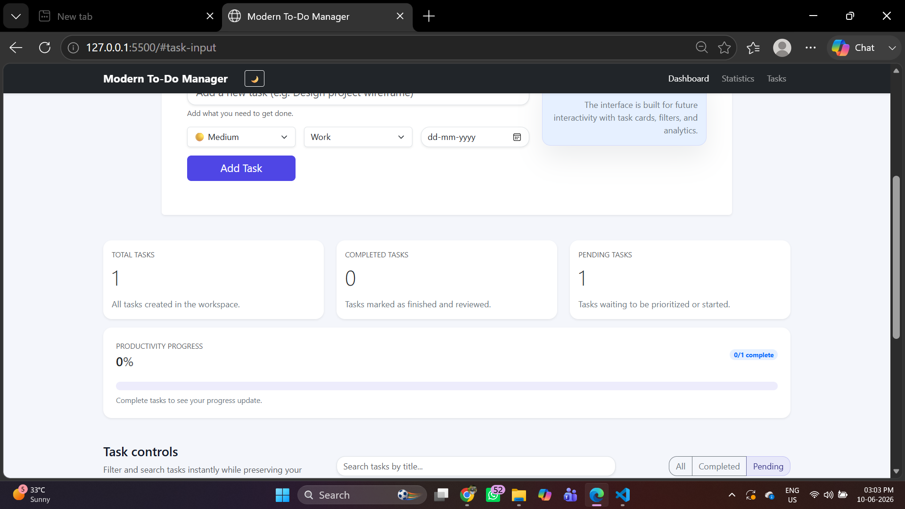

# Modern To-Do Task Manager
## Intern Information
* Full Name: Gurusha Dholwani
* Intern ID: CITS2414
* Domain: Frontend Web Development
* Duration: 4 Weeks

## Project Name
Modern To-Do Task Manager

## Project Scope
The Modern To-Do Task Manager is a responsive productivity management web application designed to help users efficiently organize, track, and manage daily tasks. The application allows users to create, edit, delete, search, filter, prioritize, categorize, and monitor tasks while maintaining persistent data using browser local storage.

## Features
* Add New Tasks
* Edit Existing Tasks
* Delete Tasks
* Mark Tasks as Completed
* Task Status Management
* Search Tasks
* Filter Tasks
* Priority Levels
* Task Categories
* Due Date Management
* Productivity Progress Tracking
* Dark Mode Support
* Local Storage Support
* Responsive Design
* User-Friendly Interface

## Technologies Used
* HTML5
* CSS3
* Bootstrap 5
* JavaScript (ES6)
* Local Storage API
* Git
* GitHub

## Folder Structure
Modern-Todo-Task-Manager/
├── index.html
├── css/
│   └── style.css
├── js/
│   └── script.js
├── assets/
│   └── screenshots/
├── documentation/
└── README.md

## Source Code
All project source files are included in this repository.
[github repo](https://github.com/GD-git-17/Modern-Todo-Task-Manager)

## Screenshots

### Home Page

### Task Creation

### Task Controls

### Task List

### Progress Tracking

## Documentation
Project documentation is available in the documentation folder.
Documentation includes:
* Project Objective
* Features
* Technologies Used
* Screenshots
* Working Process
* Conclusion

## Learning Outcomes
* DOM Manipulation
* Event Handling
* CRUD Operations
* Local Storage Management
* Search and Filtering Logic
* Data Persistence
* Responsive Web Design
* Accessibility Best Practices
* JavaScript Fundamentals
* Git & GitHub Workflow

## How to Run
1. Clone the repository.
2. Open the project folder.
3. Open index.html in any web browser.

## GitHub Repository
[github repo](https://github.com/GD-git-17/Modern-Todo-Task-Manager)

## Author
Gurusha Dholwani
Frontend Web Development Intern

## License
This project is created for educational and internship purposes.
